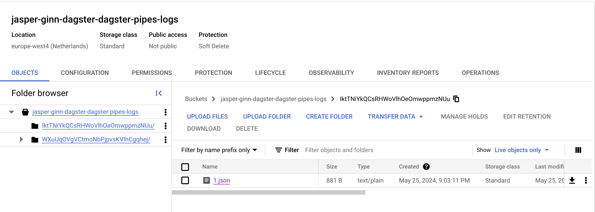
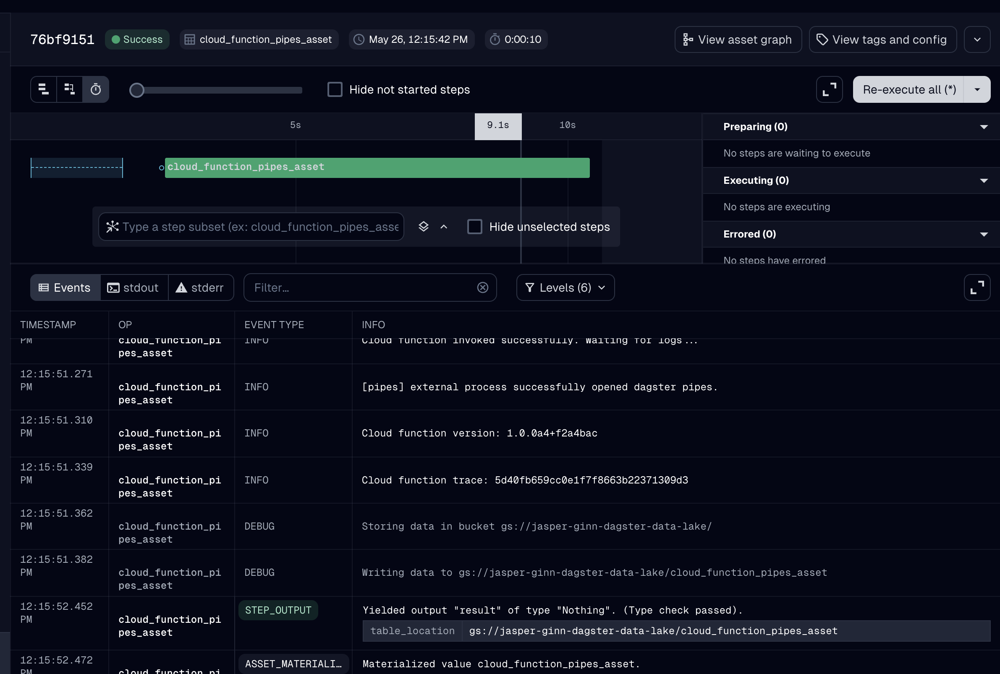

## ⛰️ Premise
---
Orchestrating external processes in tools like Airflow is straightforward, but in Dagster this wasn't possible until the release of `dagster-pipes`.

## 🦋 Type
---
[How-to guide](https://docs.divio.com/documentation-system/how-to-guides/)

## 🎯 Goal
---
Learn how to use `dagster-pipes` to orchestrate external processes with Dagster.

## 🔭 Scope
---
Show step-by-step implementation of dagster-pipes in which I extend the library with GCF.

## 👥 Audience
---
People who use Dagster.

## 📢 Call to action
---
Be excited to use Dagster. Be able to extend dagster-pipes to other external processes or use this code for their own GCF.

## 📝 Outline
---
##### 🔩 How to use Dagster pipes to orchestrate google cloud functions (or any other external execution environment)

I know, right? This *should* be a trivial task; you have some existing code deployed on, say, a Google Cloud Function, and you want Dagster to orchestrate it. This is easy to do in e.g. Airflow, but Dagster only recently added this functionality through the [`dagster-pipes`](https://docs.dagster.io/concepts/dagster-pipes) library:

> Dagster Pipes is a toolkit for building integrations between Dagster and external execution environments. It standardizes the process of passing parameters, injecting context information, ingesting logs, and collecting metadata all while remaining agnostic to how remote computations are launched in those environments. This enables the separation of orchestration and business logic in the Dagster ecosystem.

Neat! This enables us to run business logic in any execution environment. Given that there's no official integration with Google Cloud services as of yet, we'll put this to the test by extending the `dagster-pipes` library to use Google Cloud Functions as an execution environment.
### Setting up

The code for this post can be found [on GitHub](https://github.com/JasperHG90/dagster-pipes-gcp). If you're following along, then use the instructions in the README to set up your environment.

The repository contains two folders with python code:

- **dagster**: this contains the source code of the Dagster DAG. We will run this locally. When we materialize the asset that uses the cloud function, the asset should make a call to the cloud function so that our business logic executes. When the cloud function completes, we will then ingest any logs and metadata generated by the external execution environment.
- **cloud_function**: this contains the source code of the cloud function (our external execution environment). This function should take input parameters and contextual information (e.g. asset name) from the orchestrator, run our business logic, and write logs and metadata to a suitable location where it can be picked up by the orchestrator.

For this implementation, I've leaned heavily on the [dagster-pipes AWS Lambda implementation](https://github.com/dagster-io/dagster/blob/master/python_modules/libraries/dagster-aws/dagster_aws/pipes.py) and the [dagster-pipes source code](https://github.com/dagster-io/dagster/blob/master/python_modules/dagster-pipes/dagster_pipes/__init__.py).

## Implementing the cloud function logic

There's a couple of things that we need here:

- The actual business logic. We'll generate some fake data and write it to a delta table on cloud storage.
- A custom `message writer` that will capture logs, metadata and events generated in the execution environment and put them somewhere for the orchestrator to pick up.

#### Implementing the cloud function

If you're familiar with cloud functions, then this should look familiar to you. We have an entrypoint ('main') that takes a `flask.Request` input. From the request, we can parse headers [trace id](https://cloud.google.com/trace/docs/trace-log-integration) and retrieve any inputs and contextual information that the orchestrator passed to the execution environment, which are in turn used as inputs for the `open_dagster_pipes` context manager.

For example:

- The orchestrator passed the input 'dl_bucket' and we can access it using `event["dl_bucket"]`.
- We use `pipes.asset_key` to retrieve the name of the asset in the orchestration service.
- We report back the asset table location by specifying this as metadata in the `pipes.report_asset_materialization` method.

```python
def main(request: flask.Request):
    event = request.get_json()
    trace_header = request.headers.get("X-Cloud-Trace-Context") or "local"
    trace = trace_header.split("/")[0]
    with open_dagster_pipes(
        params_loader=PipesMappingParamsLoader(event),
        message_writer=PipesCloudStorageMessageWriter(
            client=google.cloud.storage.Client(),
        ),
    ) as pipes:
        pipes.log.info(f"Cloud function version: {__version__}")
        pipes.log.info(f"Cloud function trace: {trace}")
        dl_bucket = event["dl_bucket"]
        pipes.log.debug(f"Storing data in bucket {dl_bucket}")
        table_location = f"{dl_bucket}/{pipes.asset_key}"
        pipes.log.debug(f"Writing data to {table_location}")
        df = get_fake_data()
        df.write_delta(table_location, mode="append")
        pipes.report_asset_materialization(
            metadata={"table_location": table_location},
            data_version="alpha",
        )
    # Force the context to be reinitialized on the next request
    # see: https://github.com/dagster-io/dagster/issues/22094
    PipesContext._instance = None
    return "OK", 200
```

Contrary to what you might expect, this does not open up a direct connection between the orchestrator and the execution environment. All communication back to the orchestrator is handled by the `message_writer`, which here is of a custom class called `PipesCloudStorageMessageWriter`.

Essentially, all this message writer class does is to return a channel whose job it is capture any events and logs while the `open_dagster_pipes` context manager is active and write these to cloud storage.

```python
class PipesCloudStorageMessageWriter(PipesBlobStoreMessageWriter):

    def __init__(
        self,
        client: google.cloud.storage.Client,
        *,
        interval: float = 10,
    ):
        super().__init__(interval=interval)
        self._client = client

    def make_channel(
        self,
        params: PipesParams,
    ) -> "PipesCloudStorageMessageWriterChannel":
        bucket = _assert_env_param_type(params, "bucket", str, self.__class__)
        key_prefix = _assert_opt_env_param_type(params, "key_prefix", str, self.__class__)
        return PipesCloudStorageMessageWriterChannel(
            client=self._client,
            bucket=bucket,
            key_prefix=key_prefix,
            interval=self.interval,
        )


class PipesCloudStorageMessageWriterChannel(PipesBlobStoreMessageWriterChannel):

    def __init__(
        self,
        client: google.cloud.storage.Client,
        bucket: str,
        key_prefix: Optional[str],
        *,
        interval: float = 10,
    ):
        super().__init__(interval=interval)
        self._client = client
        self._bucket = client.bucket(bucket)
        self._key_prefix = key_prefix

    def upload_messages_chunk(self, payload: IO, index: int) -> None:
        key = f"{self._key_prefix}/{index}.json" if self._key_prefix else f"{index}.json"
        blob = self._bucket.blob(key)
        blob.upload_from_string(payload.read())
```

An important feature of the message writer is that it is paired with a message *reader* (see below) implementation in the orchestrator process. The reader is responsible for defining the variables 'bucket' and 'key_prefix'. The orchestrator then injects these variables in the context and sends them to the execution environment, which is how we can retrieve them here:

```python
...
        bucket = _assert_env_param_type(params, "bucket", str, self.__class__)
        key_prefix = _assert_opt_env_param_type(params, "key_prefix", str, self.__class__)
...
```

If we materialize our asset at this point, then you should see these logs popping up in cloud storage:



#### Implementing the orchestration logic

The orchestration logic looks like normal Dagster code. In this case, we define an asset definition that uses a resource, and set up a code location using an `Definitions` object:

```python
@asset(
    description="A cloud function that writes fake data to a delta table.",
)
def cloud_function_pipes_asset(
    context: AssetExecutionContext, pipes_function_client: PipesCloudFunctionClient
) -> MaterializeResult:
    return pipes_function_client.run(
        context=context,
        # function_url="http://127.0.0.1:8080",
        function_url="https://europe-west4-jasper-ginn-dagster.cloudfunctions.net/dagster-pipes-gcp-nprod",
        event={
            "dl_bucket": "gs://jasper-ginn-dagster-data-lake/",
        },
    ).get_materialize_result()

defs = Definitions(
    assets=[cloud_function_pipes_asset],
    resources={
        "pipes_function_client": PipesCloudFunctionClient(
            message_reader=PipesCloudStorageMessageReader(
                bucket="jasper-ginn-dagster-dagster-pipes-logs",
                client=google.cloud.storage.Client(),
            )
        )
    },
)
```

In the above code:
- We use a custom `PipesClient` resource that is responsible for triggering the cloud function and retrieving any logs and metadata that it has generated.
- We use a custom `PipesBlobStoreMessageReader` to read logs from the cloud storage bucket.
- We pass additional parameters, such as the `dl_bucket` parameter, to the `run` method of the instantiated `PipesCloudFunctionClient` resource.

Let's pick these pieces apart one-by-one.

##### The `PipesBlobStoreMessageReader`

This class is responsible for reading logs and metadata that we stored on cloud storage. The important bit in this class is the `download_messages_chunk` method. This method retrieves the logs stored as JSON entries in a cloud storage bucket. If the entry doesn't exist, it returns `None`, which is how the reader knows it's finished.

```python
    def download_messages_chunk(self, index: int, params: PipesParams) -> Optional[str]:
        key = f"{params['key_prefix']}/{index}.json"
        bucket = self.client.bucket(self.bucket)
        blob = bucket.blob(key)
        if blob.exists():
            return blob.download_as_text()
        else:
            return None
```

##### The `PipesClient`

The `PipesClient` is responsible for handling the request to the external execution environment and ingesting logs and metadata that it generates. In our case, ingesting logs and metadata is handled by our message reader, so the [important bit of code](https://github.com/JasperHG90/dagster-pipes-gcp/blob/main/dagster/dg_pipes.py#L159-L170) in the `PipesClient` comes down to constructing the request data and [invoking the cloud function](https://github.com/JasperHG90/dagster-pipes-gcp/blob/main/dagster/dg_utils.py#L49-L61):

```python
...
            if isinstance(self._context_injector, PipesCloudFunctionEventContextInjector):
                payload_data = {
                    **event,
                    **session.get_bootstrap_env_vars(),
                }
            else:
                payload_data: Mapping[str, Any] = event  # type: ignore

            response = invoke_cloud_function(
                url=function_url,
                data=payload_data,
            )
...
```

There's a fair amount of things happening in the background here, but what's important to note is that the `session.get_bootstrap_env_vars` method puts all the context information that is stored in the asset's [`AssetExecutionContext`](https://docs.dagster.io/_apidocs/execution#dagster.AssetExecutionContext) and any other pipeline parameters in a event payload and sends this to the cloud function.

Recall that in the cloud function message writer, we used this bit of code to get the bucket and key_prefix when writing logs to cloud storage:

```python
...
        bucket = _assert_env_param_type(params, "bucket", str, self.__class__)
        key_prefix = _assert_opt_env_param_type(params, "key_prefix", str, self.__class__)
...
```

These two parameters are also injected into the payload by the `session.get_bootstrap_env_vars` method, which is why we can access them in the cloud function. In turn, these two variables are defined in the `PipesCloudStorageMessageReader` class through its [`get_params` method](https://github.com/JasperHG90/dagster-pipes-gcp/blob/main/dagster/dg_pipes.py#L60-L63):

```python
   @contextmanager
    def get_params(self) -> Iterator[PipesParams]:
        key_prefix = "".join(random.choices(string.ascii_letters, k=30))  # nosec
        yield {"bucket": self.bucket, "key_prefix": key_prefix}
```

Note that, while we have to invoke the call to the cloud function, we don't necessarily have to do this to retrieve logs. When the `PipesClient.run` method completes, it returns a `PipesClientCompletedInvocation` class. This class will then call the appropriate function to download logs and metadata using the message reader class.

#### Materializing the asset

That was quite a bit of work, but we should be able to materialize the asset and retrieve the logs from the external execution environment. Execute `just dd` to spin up the dagster webserver and materialize the asset!



As you can see, the asset was materialized, and the metadata and logs were then ingested by dagster and are available in the UI.

### Ceci n’est pas une pipe

The functionality provided by the 'dagster-pipes' library is a useful feature that allows users to orchestrate services in external execution environments. In this post, we extended the library by adding Google Cloud Functions as an external execution environment. This process was relatively straightforward, but since the library is still experimental the documentation isn't always as helpful as it could be. If you're interested in adding your own external execution environment, then check out the [documentation](https://docs.dagster.io/concepts/dagster-pipes/dagster-pipes-details-and-customization).

## 💬 Comments
---
_Any comments that you have received_

## 🔗 Related work
---
_Related work can be added here_
